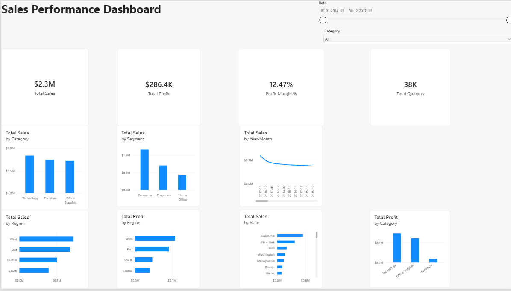

# Sales & Revenue Analysis Dashboard

An interactive **Power BI dashboard** developed to analyze sales, profitability, quantity, and business performance across categories, customer segments, regions, states, and time periods.

## Dashboard Preview



## Project Overview

This project transforms sales data into an interactive business intelligence dashboard. It provides a high-level view of key performance indicators while allowing users to explore performance across multiple business dimensions.

## Key Features

- KPI cards for **Total Sales, Total Profit, Profit Margin, and Total Quantity**
- Sales analysis by **Category**
- Sales analysis by **Customer Segment**
- Sales analysis by **Region**
- Sales analysis by **State**
- Profit analysis by **Region**
- Profit analysis by **Category**
- Sales trend analysis by **Year-Month**
- Interactive **Date** slicer
- Interactive **Category** dropdown slicer
- Dynamic filtering across dashboard visuals
- DAX measures for key business metrics

## Key Performance Indicators

| KPI | Overall Value |
|---|---:|
| Total Sales | $2.3M |
| Total Profit | $286.4K |
| Profit Margin | 12.47% |
| Total Quantity | 38K |

## Tools & Technologies

- **Microsoft Power BI** — Dashboard development and visualization
- **DAX** — Measures and KPI calculations
- **Microsoft Excel** — Source data

## Project Structure

```text
Sales-Revenue-Analysis-PowerBI/
│
├── README.md
├── Sales_Performance_Dashboard.pbix
├── Sales_Performance_Dashboard.png
│
└── dataset/
    └── sales_data.xlsx
```

## Dashboard Interactivity

The dashboard includes interactive filters that allow users to explore the data dynamically.

Selecting a category such as **Technology**, **Furniture**, or **Office Supplies** updates the KPI cards and related visualizations to reflect the selected category.

The date slicer can also be used to analyze performance over a specific period.

## Business Insights

The dashboard is designed to help users quickly identify:

- Overall sales and profitability performance
- Top-performing product categories
- Differences between customer segments
- Regional sales and profit patterns
- State-level sales performance
- Sales trends over time
- The relationship between sales and profitability

## Project Files

- **`Sales_Performance_Dashboard.pbix`** — Complete Power BI dashboard and data model.
- **`Sales_Performance_Dashboard.png`** — Static preview of the completed dashboard.
- **`dataset/sales_data.xlsx`** — Source dataset used for the analysis.

## Purpose

This project demonstrates practical skills in **business intelligence, data visualization, dashboard design, KPI development, interactive filtering, and DAX-based analysis** using Microsoft Power BI.
